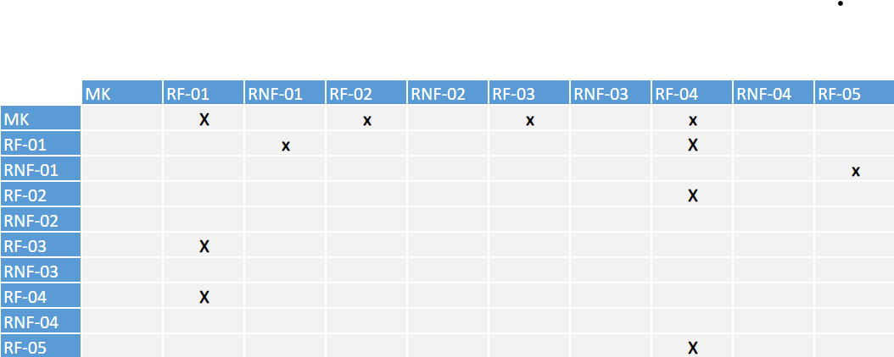

# Especificações do Projeto

Esse projeto tem como intenção o desenvolvimento dessa aplicação focando na necessidade de uma ferramenta que facilite a disponibilidade de jogos para os desenvolvedores de jogos e o acesso a jogos para os gamers. Pensando nisso, foram criadas as seguintes personas e histórias de usuário para colaborar com o escopo deste projeto.

## Personas

NOME | PROFISSÃO E IDADE | MOTIVAÇÕES | FRUSTRAÇÕES | HOBBIES, HISTÓRIA| APLICATIVOS, SITES |
|----|----|----|----|----|----|
Carlos Henrique | - Estudante   - 16 anos | Está buscando uma plataforma que forneça jogos grátis. | Está tentando conseguir uma oportunidade de menor aprendiz faz algum tempo e não obteve sucesso. | - Gosta de jogar videogame   - Viajar   - Não consegue comprar jogos com frequência | - Instagram   - Twitter   - Facebook   - Twitch |
Rogério Guimarães | - Gerente de loja de calçados   - 32 anos | Está buscando uma plataforma que forneça jogos grátis   - Gostaria de uma ferramenta que possa organizar e encontrar seu jogos facilmente. | Tem dificuldades de catalogar e organizar seus jogos.   -  Está ficando sem espaço físico para guardar sua coleção. | - Coleciona jogos antigos   - Seu video game preferido é o Nintendo 64   - Adora andar de bicicleta | - Instagram   - LinkedIn   - Facebook |
Elaine Resende | - Desenvolvedora de jogos   - 27 anos | Busca uma plataforma para disponibilizar seus jogos.   - Está disposta a fornecer chaves gratuitas desses jogos para divulgação. | A pouca quantidade de mulheres no cenário competitivo de jogos. | - Seu primeiro contato com jogos foi aos 4 anos de idade.   - Já foi jogadora profissional de League of Legends. | - Facebook   - LinkedIn   - Twitch|
Fernanda Souza | - Corretora de imóveis   - 38 anos | Buscando uma plataforma que recomende jogos de acordo com o seu perfil. | - Tentou jogar alguns jogos,  porém eles eram difíceis.  - Não gostou de jogos online, pois os outros jogadores foram desrespeitosos. | - Começou a jogar em 2020.   - Seu jogo preferido é Among Us.   Joga vôlei aos fins de semana. | - Facebook   - LinkedIn   - Twitter |

## Histórias de Usuários

Com base na análise das personas forma identificadas as seguintes histórias de usuários:

|EU COMO... `PERSONA`| QUERO/PRECISO ... `FUNCIONALIDADE` |PARA ... `MOTIVO/VALOR`                 |
|--------------------|------------------------------------|----------------------------------------|
|Carlos Henrique  | Resgatar jogos grátis           | Jogar grandes títulos sem gastar dinheiro, pois não tem emprego.               |
|Rogério Guimarães       | Visualizar quantos e quais jogos possui.                  | Saber a situação de sua coleção.  |
|Rogério Guimarães       | Organizar e encontrar os jogos rapidamente.                 | Poder jogar um jogo específico rapidamente. |
|Elaine Resende       | Cadastrar jogos na plataforma.                 | Poder vender esses jogos para os usuários. |
|Fernada Souza       | Receber recomendações de jogos.                 | Encontrar jogos que sejam relacionados ao seu gosto pessoal. |

## Modelagem do Processo de Negócio 

### Análise da Situação Atual

Apresente aqui os problemas existentes que viabilizam sua proposta. Apresente o modelo do sistema como ele funciona hoje. Caso sua proposta seja inovadora e não existam processos claramente definidos, apresente como as tarefas que o seu sistema pretende implementar são executadas atualmente, mesmo que não se utilize tecnologia computacional. 

### Descrição Geral da Proposta

Apresente aqui uma descrição da sua proposta abordando seus limites e suas ligações com as estratégias e objetivos do negócio. Apresente aqui as oportunidades de melhorias.

### Processo 1 – NOME DO PROCESSO

Apresente aqui o nome e as oportunidades de melhorias para o processo 1. Em seguida, apresente o modelo do processo 1, descrito no padrão BPMN. 

### Processo 2 – NOME DO PROCESSO

Apresente aqui o nome e as oportunidades de melhorias para o processo 2. Em seguida, apresente o modelo do processo 2, descrito no padrão BPMN.

## Indicadores de Desempenho

Apresente aqui os principais indicadores de desempenho e algumas metas para o processo. Atenção: as informações necessárias para gerar os indicadores devem estar contempladas no diagrama de classe. Colocar no mínimo 5 indicadores. 

Usar o seguinte modelo: 

Obs.: todas as informações para gerar os indicadores devem estar no diagrama de classe a ser apresentado a posteriori. 

## Requisitos

As tabelas que se seguem apresentam os requisitos funcionais e não funcionais que detalham o escopo do projeto. Para determinar a prioridade de requisitos, aplicar uma técnica de priorização de requisitos e detalhar como a técnica foi aplicada.

### Requisitos Funcionais

|ID    | Descrição do Requisito  | Prioridade |
|------|-----------------------------------------|----|
|RF-001| O sistema deve ser acessado por meio web e mobile | ALTA | 
|RF-002| Um resgate deve ser vinculado com um usuário e armazenado em uma tabela especifica para auditoria |  BAIXA | 
|RF-003| Ao resgatar um jogo com sucesso, ele receberá um e-mail informando do resgate |  ALTA | 
|RF-004| Desenvolvedores de jogos poderão cadastrar seus jogos |  MÈDIA | 
|RF-005|  A aplicação deve permitir operações de CRUD de  jogos |  ALTA | 
|RF-006|  O usuário deve se cadastrar ou fazer login no site para acessar | ALTA | 
|RF-007|  Durante um tempo limitado, o usuário pode resgatar os jogos oferecidos apenas uma vez e se não possuir o jogo  | MÉDIA |

### Requisitos não Funcionais

|ID     | Descrição do Requisito  |Prioridade |
|-------|-------------------------|----|
|RNF-001| O app deve fser acessivel atraves de sistemas operacionais "Android" e "iSO | ALTA | 
|RNF-002| a aplicação deve ser desenvolvida usando react para o front-end | ALTA | 
|RNF-003| A aplicação devem estar disponiveis 24 horas por dia e 07 dias da semana | ALTA | 
|RNF-004| O sistema deverá ser compatível com os principais navegadores do mercado como (Google Chrome, Firefox, Microsoft Edge)| MÈDIA | 

## Restrições

A tabela a seguir define o conjunto de restrições impostas sobre o desenvolvimento do software. 
 
|ID| Restrição                                             |
|--|-------------------------------------------------------|
|01| A equipe possui um prazo de entrega do projeto até o final do semestre letivo, e tem como data de apresentação limite 14/12/2022. |
|02| O projeto deve ser desenvolvido seguindo os princípios de uma aplicação distribuída. |
|04|  A equipe não pode subcontratar o desenvolvimento do trabalho. |

## Diagrama de Casos de Uso

O diagrama de casos de uso é o próximo passo após a elicitação de requisitos, que utiliza um modelo gráfico e uma tabela com as descrições sucintas dos casos de uso e dos atores. Ele contempla a fronteira do sistema e o detalhamento dos requisitos funcionais com a indicação dos atores, casos de uso e seus relacionamentos. 

As referências abaixo irão auxiliá-lo na geração do artefato “Diagrama de Casos de Uso”.

> **Links Úteis**:
> - [Criando Casos de Uso](https://www.ibm.com/docs/pt-br/elm/6.0?topic=requirements-creating-use-cases)
> - [Como Criar Diagrama de Caso de Uso: Tutorial Passo a Passo](https://gitmind.com/pt/fazer-diagrama-de-caso-uso.html/)
> - [Lucidchart](https://www.lucidchart.com/)
> - [Astah](https://astah.net/)
> - [Diagrams](https://app.diagrams.net/)

# Matriz de Rastreabilidade

A matriz de rastreabilidade é uma ferramenta usada para facilitar a visualização dos relacionamento entre requisitos e outros artefatos ou objetos, permitindo a rastreabilidade entre os requisitos e os objetivos de negócio. 

# Gerenciamento de Projeto

De acordo com o PMBoK v6 as dez áreas que constituem os pilares para gerenciar projetos, e que caracterizam a multidisciplinaridade envolvida, são: Integração, Escopo, Cronograma (Tempo), Custos, Qualidade, Recursos, Comunicações, Riscos, Aquisições, Partes Interessadas. Para desenvolver projetos um profissional deve se preocupar em gerenciar todas essas dez áreas. Elas se complementam e se relacionam, de tal forma que não se deve apenas examinar uma área de forma estanque. É preciso considerar, por exemplo, que as áreas de Escopo, Cronograma e Custos estão muito relacionadas. Assim, se eu amplio o escopo de um projeto eu posso afetar seu cronograma e seus custos.

## Gerenciamento de Tempo

Com diagramas bem organizados que permitem gerenciar o tempo nos projetos, o gerente de projetos agenda e coordena tarefas dentro de um projeto para estimar o tempo necessário de conclusão.

O gráfico de Gantt ou diagrama de Gantt também é uma ferramenta visual utilizada para controlar e gerenciar o cronograma de atividades de um projeto. Com ele, é possível listar tudo que precisa ser feito para colocar o projeto em prática, dividir em atividades e estimar o tempo necessário para executá-las.

## Gerenciamento de Equipe

O gerenciamento adequado de tarefas contribuirá para que o projeto alcance altos níveis de produtividade. Por isso, é fundamental que ocorra a gestão de tarefas e de pessoas, de modo que os times envolvidos no projeto possam ser facilmente gerenciados. 

## Gestão de Orçamento

O processo de determinar o orçamento do projeto é uma tarefa que depende, além dos produtos (saídas) dos processos anteriores do gerenciamento de custos, também de produtos oferecidos por outros processos de gerenciamento, como o escopo e o tempo.

